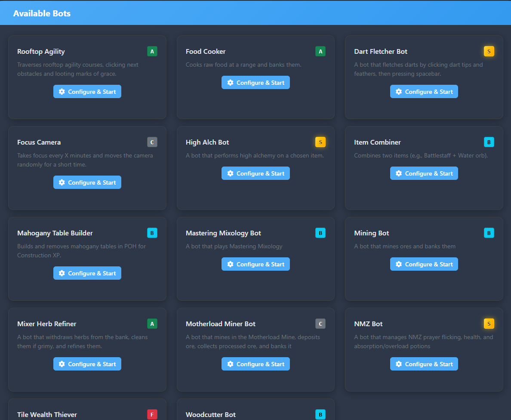
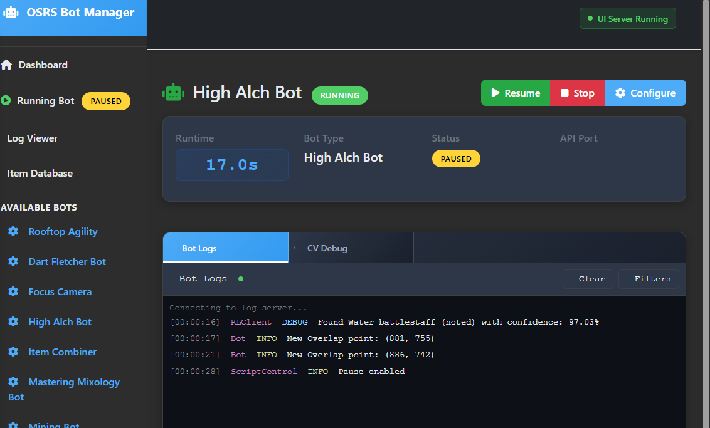
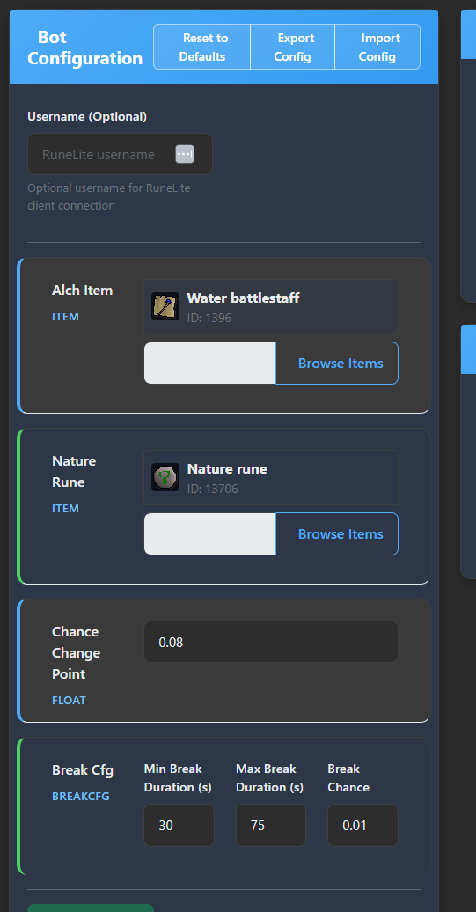

# Old-school RuneScape Computer Vision Bot
A vibe coding experiment that has grown into a pretty impressive botting framework.

I wouldn't recommend using this if you aren't willing to get your hands dirty writing some python.

 > Official support for **Windows** only, sorry

 ## Setup

 - Play using the runelite client, on windows OS
 - Install python >=3.10
 - Clone repo
 - Open powershell, cd into cloned directory
 - Run:
 ```bash
python -m pip install virtualenv
python -m venv venv
./venv/Scripts/Activate.ps1
pip install -r requirements.txt

python main.py
 ```


 ## Demos

 ### Item Combiner -  [item_combiner.py](./bots/item_combiner.py)

https://github.com/user-attachments/assets/8d7b6eb6-8b16-466c-b32c-9fde9a23fa37

 ### Rooftop Agility - [agility.py](./bots/agility.py)

https://github.com/user-attachments/assets/226daf47-361a-433d-89e3-dad1afb1c87a

### New UI

> Still a bit buggy






### Computer Vision Debugger


 ## Install
Full UI experience
```bash
python -m pip install -r requirements.txt
python main.py
```


Direct bot invocation (need this for bots with complex params ie. list of items):
Create new file
```python
# update bot script here
from bots.master_mixer import BotConfig, BotExecutor


def main():
    config = BotConfig()
    bot = BotExecutor(config)
    
    bot.start()
    
main()
```

### Bot Hotkeys 
- **Page Up**: Terminate the bot immediately
- **Page Down**: Pause/Resume the bot

NOTE: the bot script architecture is migrating from legacy (scripts defined in base dir) to the new bot architecture defined in [./bots](bots/). Invocation of the new architecture can be seen above.

The new architecture has a core bot class defined here [Bot()](core/bot.py). This Bot() class is used as a way to have all the core components (RuneLiteClient(), ScriptControl(), MovementOrchestrator(), BankInterface(), ItemLookup()) all in one class.

Noteworthy scripts:
- [High Alchemy](./bots/high_alch.py)
- [Motherload Miner](./bots/motherload_miner.py)
- [Mastering Mixology](./bots/master_mixer.py)
- [Nightmare Zone](./bots/nmz.py)
